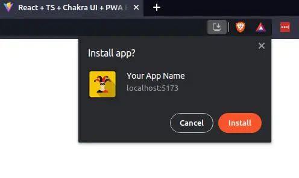
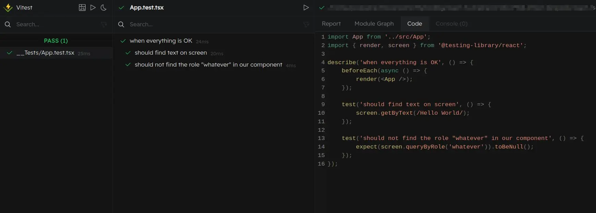
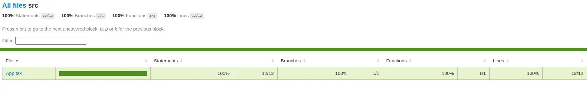

# Boilerplate / Template

This boilerplate monorepo includes 3 configs type:

1. React + TypeScript + Chakra UI + Vite
2. React + TypeScript + Chakra UI + Vite + Vite PWA
3. React + TypeScript + Chakra UI + Vite + Vitest (for testing)

## How to use

1. Click on "use this template" in GitHub
2. Clone the repo locally `git clone <your SHH key>`
3. Grab all the files in the config you want and drag them to the root folder you just created
4. Delete the other config folder
3. `cd <your repo name>`
4. `npm install`
5. You're set!

### Screenshot

## Package Update

The package of this repo update automatically on a regular basis.
But if you want to make sure you're are using the latest package use:
`npm update --save --include=dev`

## Chakra UI theming

In the `src` forlder you'll find a `theme` folder which includes all Chakra UI default theme.
These files already extend the theme, so you can modify directly in these files to create customs styles!!!

If you don't want to use that, simply delete the `theme` folder and everything `theme` on line 5 and 10 of `main.tsx`
